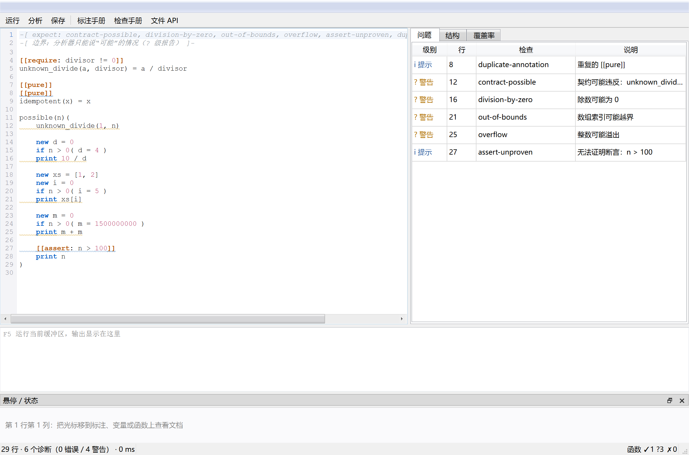
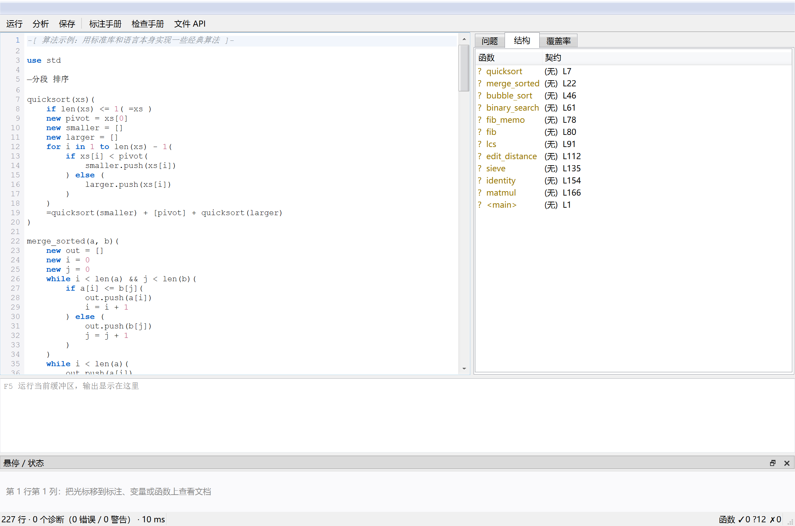
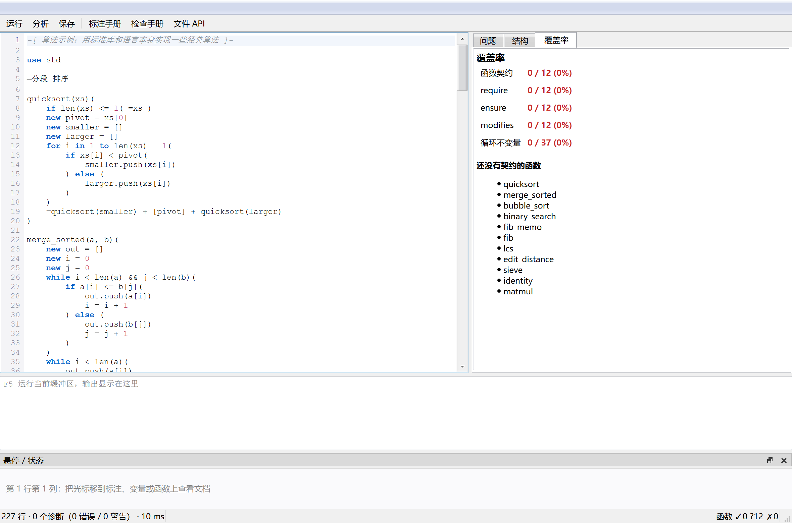
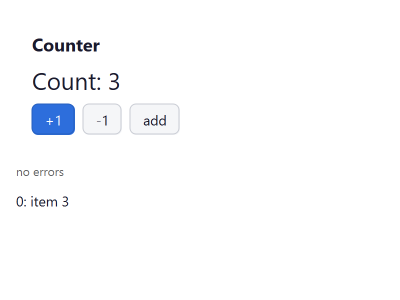

<div align="center">

# Annota

**A statically verifiable language, implemented in C++17 with a bytecode VM — plus the tooling around it: a REPL, a three-layer analyzer and a graphical IDE.**

[English](README.md) | [简体中文](README_zh.md)

[](https://github.com/Melba0/annota/actions/workflows/build.yml)
[](https://github.com/Melba0/annota/releases/latest)
[](#quick-start)
[](#the-graphical-ide)
[](#verification)
[](docs/reference.md)
[](#license)



</div>

---

Annota is a small, annotation-driven language whose specification and implementation grew
together. Annotations are not decoration: `[[require]]`, `[[ensure]]`, `[[invariant]]`,
`[[decrease]]`, `[[taint]]` and friends are *specifications*, and the analyzer turns them into
either a proof obligation or a concrete bug report. The interpreter runs the same source that
the analyzer reads, so "what the tool tells you" and "what the program does" cannot drift apart.

**Highlights**

* 🧩 **One language, four front ends** — CLI runner, REPL, graphical IDE (`annota studio`), LSP server for editor plugins. All four share the same toolchain: no second implementation to keep in sync.
* 🔍 **Three-layer static analysis** — keystroke (<50 ms), save (<500 ms) and background (<5 s) budgets, 32 diagnostic codes, abstract interpretation over a CFG, contract checking at call sites.
* 🖥️ **Real Qt 6 GUI** — both for programs written in Annota (`view` components) and for the IDE that you write them in. Both degrade gracefully: a `-NoQt` build still gets `--gui-tree`, the REPL and the whole analyzer.
* 🔢 **C style numeric widths** — `int8..int64` / `uint8..uint64` / `float32` / `float64` plus the
  boxed `longlong` (128-bit) and `longdouble` (80-bit); declared widths wrap and round like C, and
  integer division truncates toward zero.
* 🧱 **Fixed size typed arrays** — `int[5]`, `int[3][4]`, `int[]` with contiguous storage, auto
  padding, O(1) row views, static bounds proofs and a `[[unsafe]]` opt-out from the runtime check.
* ⚡ **Machine code, with or without a marker** — the interpreter compiles hot integer loops to
  x86-64 by itself (in place, mid-function); `[[jit]]` is the one annotation that asks for the same
  backend at load time. Semantics never change: anything that cannot be translated keeps running
  interpreted. See [docs/jit.md](docs/jit.md).
* 🔌 **Hot-pluggable native code** — `annota plugin build mycode.cpp` turns one C++ file into a
  plugin that `use mycode` loads at run time; the hot standard-library kernels live that way too,
  so extending the library needs no core change and no interpreter rebuild.
* 🤝 **Explicit sharing when you want it** — values deep copy on assignment, argument passing and
  return (predictable, no spooky action); `lend a = b` is the opt-in reference that makes two names
  share one storage cell.
* 🧭 **Case analysis and `elif`**: `if` / `elif` / `else` chains, where each path learns its own
  facts (`if i < 1 ( i = 1 )` then proves `i >= 1`), a branch that returns does not pollute the
  join, and every diagnostic says which branch it came from.
* 🧠 **The IDE knows the types**: hovering `int` / `long` / `longlong` / `double` ... reports the
  type (width, signedness, how to declare and convert), completion offers them as `type` items and
  the editor highlights them - all from one registry the parser, analyzer and highlighter share.
* 📁 **Batteries included, in the language itself** — C++ only exposes _-prefixed primitives (clock, env, threads, sockets, files) plus the hot kernels behind [FFI](docs/ffi.md); Seq / Str / Dict / Mathx / File / Path / Time / Os / Thread / Net / Test are .mod files written in Annota. New capabilities are new modules — or a plugin you build with one command, without rebuilding the interpreter.
* ⚡ **Fast where it matters** — hot integer loops are compiled to x86-64 automatically (no annotation needed; `[[jit]]` only asks for it at load time), and the hot library kernels are native, so sorting/median/`argsort` are single C++ calls.
* ✅ **Self-checking** — `build.ps1 -Verify` runs 19 example programs (600+ assertions), 16 analyzer fixtures, a plugin round-trip, a performance benchmark, an LSP end-to-end test, a highlighter check and a headless IDE render.

---

## Table of contents

- [Quick start](#quick-start)
- [The language in 30 lines](#the-language-in-30-lines)
- [Command line](#command-line)
- [Tools and native plugins](#tools-and-native-plugins)
- [The REPL](#the-repl)
- [The graphical IDE](#the-graphical-ide)
- [Static analysis](#static-analysis)
- [Editor integration (LSP)](#editor-integration-lsp)
- [Standard library](#standard-library)
- [Primitives](#primitives)
- [Files and paths](#files-and-paths)
- [Project layout](#project-layout)
- [Verification](#verification)
- [Performance](#performance)
- [FAQ & troubleshooting](#faq--troubleshooting)
- [Contributing](#contributing)
- [License](#license)

---

## Quick start

**Prebuilt bundles** (no toolchain, no Qt install) are attached to every
[release](https://github.com/Melba0/annota/releases/latest): unzip, then

```powershell
.\annota.exe examples\selfcheck.ant      # Windows x64 bundle
./annota examples/selfcheck.ant          # Linux x86_64 bundle
```

`lib/` sits next to the executable and `src/` ships with it, so the standard library works out of
the box and `annota plugin build` works from the extracted folder.

Building from source:

```powershell
git clone https://github.com/Melba0/annota.git
cd annota

# build (auto-detects Qt 6 in D:\Qt, C:\Qt, %USERPROFILE%\Qt)
powershell -ExecutionPolicy Bypass -File build.ps1
# build and run every check (examples, analyzer fixtures, benchmark, LSP, IDE)
powershell -ExecutionPolicy Bypass -File build.ps1 -Verify

build\annota.exe examples\selfcheck.ant    # 78 assertions covering the language
build\annota.exe studio                    # the graphical IDE
build\annota.exe plugin build plugins\hello.cpp   # C++ plugin, no rebuild (docs/tools.md)
```

Requirements: a C++17 compiler (MinGW-w64 g++ 13 or MSVC 2022). **Qt 6 Widgets is optional** —
without it you lose the window and the IDE, nothing else.

| Build flavour | Command | You get |
|---|---|---|
| Full | `build.ps1` | interpreter + `--gui` + `annota studio` + LSP |
| No Qt | `build.ps1 -NoQt` | interpreter + REPL + analyzer + LSP (no windows) |
| CMake | `cmake -S . -B build -DCMAKE_PREFIX_PATH=<Qt>/<ver>/<kit>` | same as full |

Verify what a binary can do at any time:

```powershell
build\annota.exe --features
# contracts annotations files gui ide <- full build
# contracts annotations files (+ guidance) <- no-Qt build
```

## The language in 30 lines

There is no `main`: a file is a script, and its top-level statements run in order. Declare things
above where you use them.

```annota
-[ annotations are the specification ]-
[[module: demo]]
[[require: divisor != 0]]
[[ensure: result * divisor == dividend]]
divide(dividend, divisor) = dividend / divisor

[[invariant: i >= 0]]
[[decrease: limit - i]]
count_to(limit)(
    new i = 0
    while i < limit( i = i + 1 )
    =i
)

-- top level code: this *is* the entry point
new xs = [3, 1, 4, 1, 5]
for x in Seq.sort(xs)( print x )

lend alias = xs          -- references are explicit: `lend` shares storage, everything else copies
alias.push(9)            -- xs is now [3, 1, 4, 1, 5, 9]

new text = "hello"
print text.upper(), len(text)

new d = Dict()
d.set("k", 42)
print d.get("k")

print divide(10, 2)        -- 5
print count_to(4)          -- 4

try_it()                   -- raises, caught below
except e( print "caught: " + e )
```

Wrapping everything in a `main()` function is *not* required and only changes when the code runs
(the function body is skipped until you call it) — see [docs/style.md](docs/style.md).

Features: deep-copy value semantics, closures with shared captures, classes with inheritance and
magic methods (`__len__`, `__str__`, `__call__`, `__iter__`, …), declarative `view` components with
reactive `state`, compile-time macros, `Ok`/`Err`, slicing (`xs[1:4]`), optional/named/variadic
parameters, piecewise expressions, `guard`-free error handling with `except`.

### Syntax details

**Constructors.** The class parameter list holds the constructor parameters; `__init__` takes
**empty parentheses**, runs at construction time, and sees those parameters as locals. Declared
field defaults are applied first, so `__init__` can override them.

```annota
Point(x, y)=(
    X:int              -- declared field, default 0
    Y:int
    __init__()(
        X = x          -- `x`, `y` are the class parameters, visible here
        Y = y
    )
    norm2() = X * X + Y * Y
)
new p = Point(3, 4)
print p.norm2()        -- 25
```

**Several statements per line.** Declarations, assignments and deletions accept comma lists, and a
comma also separates statements when a line holds more than one:

```annota
new a, b                   -- two declarations
new x = 1, y = 2, z = 3    -- each with its own value
a = 1, b = 2               -- two assignments on one line
del a, b                   -- delete both
d + "y"                    -- a bare expression statement is fine
```

**Line continuation.** A line ending in a binary operator continues on the next line, and `\` joins
explicitly, so long arithmetic can be laid out naturally:

```annota
new total = 1 +
            2 +
            3                      -- 6
new joined = "a" + \
             "b"                   -- "ab"
```

**Variadic parameters.** `*args` (Python style) and `...args` are equivalent; the collected value is
an ordinary `List`. `**kwargs` is **not** supported — pass a `Dict` instead.

```annota
total(*nums)(
    new s = 0
    for n in nums( s = s + n )
    =s
)
print total(), total(1), total(1, 2, 3)     -- 0 1 6

join_with(sep, *parts)( ... )               -- fixed parameters first, then the variadic tail
```

**Slicing** (`use slice`) keeps the type: a list or tuple slice is a read-only `SliceView`
(`.to_list()`, `len`, iteration), a **string slice is a string**.

```annota
new arr = [10, 20, 30, 40, 50]
print arr[1:3].to_list()   -- [20, 30]
print arr[2:]              -- SliceView(30, 40, 50)
new text = "abcdefg"
print text[2:5]            -- "cde"   (a String, not a view)
```

**Two formatting rules that bite.** An `else` must sit on the same line as the `)` that closes the
`if` body — the formatter relies on that to tell a statement from an expression:

```annota
if n > 0( print "positive" ) else ( print "not positive" )     -- ✓
if n > 0(
    print "positive"
) else (                                                        -- ✓ `) else (` on one line
    print "not positive"
)
```

and a statement cannot be broken across lines unless the line ends with an operator, a comma inside
brackets, or a `\`:

```annota
new s = "a" +
        "b"          -- ✓ continuation
new t = "a"
        + "b"        -- ✗ `+ "b"` is parsed as a new statement
```

📘 **[Syntax reference](docs/syntax.md)** — every statement, operator and literal, plus value and
reference semantics (`lend`), line continuation and `else` placement.
📘 **[Coding style](docs/style.md)** — how to lay out a file, name things and use annotations.
📘 **[Tools and native plugins](docs/tools.md)** — build flags, every subcommand and option, all
environment variables, the plugin workflow and troubleshooting.
📘 **[`[[jit]]`](docs/jit.md)** — what the optimisation marker does: superinstructions plus a
x86-64 machine-code backend for integer code, with automatic hot-loop promotion and fallback.
📘 **[Linking C++ (FFI)](docs/ffi.md)** — register native functions and modules from C++, either
linked into the binary or loaded as a plugin; the way to make the standard library faster
without touching the language core.

Native code is hot-pluggable: `annota plugin build mycode.cpp` produces a plugin and `use mycode`
loads it - the interpreter does not need to be rebuilt (see `plugins/hello.cpp`).  Hot loops in
Annota itself are compiled to machine code automatically; `[[jit]]` only says "compile at load
time".

The standard library is layered accordingly: the language core is lexer / parser / compiler / VM,
`lib/*.mod` is the readable script layer, and the hot kernels live in C++ registered through the
FFI — `Seq.sort`, `kth`, `median`, `dedup`, `sort_by`, `lower_bound` and `upper_bound` call the
native `seqnative` module in `native/seq_native.cpp`, which is not part of the core at all.
*(Both guides are currently written in Chinese.)*

## Command line

```
annota                          REPL (also the default with no arguments)
annota studio [file.ant]        graphical IDE (Qt build)
annota run|check <file.ant>     execute / parse only
annota analyze <file> [opts]    static analysis        (see docs/reference.md)
annota analyze-suite <dir>      run the checker over fixtures
annota ide <query> <file> ...   hover, definition, rename, complete, inline,
                                coverage, quickfix, suppressions, report,
                                checks, annotations, docs
annota bench                    analysis performance benchmark
annota lsp                      language server (stdio, JSON-RPC)
annota plugin build <file.cpp>  turn one C++ file into a plugin   (docs/tools.md)

  -e <code>            evaluate a snippet
  --dump-tokens        print the token stream
  --dump-ast           print the parsed program
  --dump-bc            disassemble the bytecode
  --dump-annotations   print the annotation index as JSON
  --contracts          evaluate assert/require/ensure/invariant at run time
  --plugin <file>      load a native plugin (repeatable)   (docs/tools.md)
  --gui                show the program's view in a window   (Qt build)
  --gui-tree           print the view tree as text           (no Qt needed)
  --gui-shot <png>     render the view to a PNG without opening a window
  --features           report the capabilities of this binary
```

`annota analyze` also takes `--level N`, `--modules` and `--json`; `annota studio` takes
`--run`, `--preview`, `--echo`, `--shot <png>`, `--tab=<name>` and `--check-highlight` for
headless use.  Every option, environment variable and workflow is documented in
**[docs/tools.md](docs/tools.md)**.

## Tools and native plugins

Extend the standard library with C++ **without rebuilding the interpreter**: one command builds a
plugin, and a program picks it up with a plain `use`:

```powershell
build\annota.exe plugin build plugins\hello.cpp     # -> build\plugins\hello.dll
build\annota.exe examples\plugin.ant                # the script says `use hello`
```

Hot loops inside Annota are compiled to machine code automatically (see
[docs/jit.md](docs/jit.md)); `[[jit]]` only asks for it to happen at load time.

| Environment variable | Effect |
|---|---|
| `ANNOTA_PLUGIN` | plugins to load at start-up, separated by `;` (Windows) or `:` |
| `ANNOTA_JIT_THRESHOLD` | backward jumps before a loop compiles itself (default 4000, `0` = off) |
| `ANNOTA_NO_JIT` | disable the machine-code backend entirely (fusion stays on) |
| `ANNOTA_JIT_DEBUG` | print what is compiled automatically and what is not translatable |
| `CXX` | compiler used by `annota plugin build` |

Full details: [docs/tools.md](docs/tools.md) · [docs/ffi.md](docs/ffi.md) · [docs/jit.md](docs/jit.md).

## The REPL

`annota` with no arguments starts an interactive session with a persistent VM, so definitions
survive between inputs:

```
annota> new x = 10
annota> x * 3
30
annota> add(a, b)( =a + b )
annota> add(1, 2)
3
annota> :analyze
<repl>: 0 errors, 0 warnings, 0 infos (1.0 ms, 6 lines)
```

| Command | Purpose |
|---|---|
| `:help` / `:quit` | help / leave |
| `:globals` / `:macros` | list globals and registered macros |
| `:load <file>` | execute a file inside the session |
| `:analyze [snippet]` | run the analyzer over the session history (or one snippet) |
| `:bc <code>` / `:tokens <code>` | disassemble / dump tokens |
| `:reset` | forget globals, classes and macros |

Incomplete brackets switch the prompt to `...>` so functions, classes and lists can span lines.

## The graphical IDE

```powershell
build\annota.exe studio examples\algorithms.ant
```

| Problems | Structure | Coverage |
|---|---|---|
|  |  |  |

* **Editor** — line numbers, Annota syntax highlighting, diagnostic squiggles, current-line
  highlight, auto-indent, bracket pairing, `Tab` = 4 spaces.
* **Problems** — severity, line, check code and message; **double-click jumps to the line**;
  the tooltip carries the abstract values and the suggested fix.
* **Structure** — every function with its **✓ / ? / ✗** contract status, double-click to jump.
* **Coverage** — contract and loop-invariant coverage, functions still lacking contracts, the
  list of `[[ignore]]` suppressions (including the ones that no longer suppress anything), and
  every available quick fix.
* **Output** — `F5` runs the buffer (or `Ctrl+F5` with contract checks); a failing run jumps to
  the offending line. When the program defines a `view`, the panel tells you to press `F7`.
* **Preview (`F7`)** — runs the buffer and opens the program's own `view` as a real Qt window,
  wired to its `state`, so buttons and counters work. `Ctrl+F7` prints the component tree
  instead. Plain `F5` stays a console run — that is why a GUI program appears to "do nothing"
  if you only press `F5`.
* **Hover panel + status bar** — annotation documentation, the analyzer's abstract state for the
  variable under the cursor, diagnostics of the current line, and a `✓ ? ✗` function summary.
* **`input` works here too** — in the IDE (and in a `--gui` program) `input name` opens a modal
  input dialog titled with the variable name instead of waiting for a console; a cancelled
  dialog yields an empty string. Head-less runs can pre-answer with `ANNOTA_INPUT=<text>`
  (UTF-8, ASCII is safest on a non-UTF-8 console), which is what CI uses. See
  [examples/input.ant](examples/input.ant).
* **Help menu** — annotation manual (`F1`), check manual (`F2`) and the file API, all generated
  from the analyzer's own registries.

Shortcuts: `F5`/`Ctrl+F5` run, `F7`/`Ctrl+F7` preview the program's view (or print its component
tree), `F6` analyze, `Ctrl+S` save, `Ctrl+/` comment, `Ctrl+1` insert the selected quick fix,
`Ctrl+Shift+1` insert all of them.

The IDE can also run head-less, which is what CI uses:

```powershell
build\annota.exe studio examples/files.ant --run --shot ide.png        # screenshot, then exit
build\annota.exe studio examples/gui_counter.ant --preview --shot p.png   # also open the view window
```

Programs written in Annota can open their own windows too:



```powershell
build\annota.exe examples\gui_counter.ant --gui
```

## Static analysis

```powershell
build\annota.exe analyze examples/analysis/01_basics.ant
build\annota.exe analyze file.ant --json > report.json
build\annota.exe analyze file.ant --level=1 --min-severity=warning
build\annota.exe analyze file.ant --int-bits=64 --modules
```

Three layers, each with a latency budget:

| Layer | Trigger | Content | Budget |
|---|---|---|---|
| L1 | keystroke | lexer/parser errors, bracket mismatch, annotation registry/scope/conflicts | 50 ms |
| L2 | save | intra-procedural data flow: division by zero, overflow, out of bounds, null dereference, uninitialised, dead store, unreachable, type/scope/iterator errors, call-site contracts, `ensure`, `invariant` | 500 ms |
| L3 | background | loop invariant preservation, termination, taint, purity, macro side effects, redundant conditions | 5 s |

The **32 diagnostic codes** are stable identifiers (`severity`: `error` = provably wrong,
`warning` = possible, `info` = note). Every report is available as JSON:

```json
{
  "file": "examples/analysis/01_basics.ant",
  "errors": 5, "warnings": 0, "infos": 3, "elapsedMs": 2,
  "diagnostics": [
    { "line": 12, "column": 1, "severity": "error", "code": "division-by-zero",
      "message": "除零", "detail": "除数恒为 0",
      "fix": "加 [[assert: b != 0]] 或 [[require: b != 0]]" }
  ]
}
```

> Diagnostic **messages are Chinese**; codes, severities and the JSON schema are English, so
> tooling should key on `code`. The full list lives in [docs/reference.md](docs/reference.md)
> (generated from the analyzer's registries by `annota ide docs`).

**A small CAS backs the checks.** Conditions are normalised to integer linear forms
(`sum(k_i * v_i) + c`), so `assert(i + 1 > i)`, `assert(2 * k == k + k)` or `assert(n - 1 < n)`
are *proved* rather than reported as unprovable, `[[assume: x == 5]]` becomes a substitution
that makes `assert(x * 2 == 10)` provable, and `if a + 1 > a` is flagged as redundant.

**Annotations as specifications.** `[[assume]]` narrows the abstract state, `[[assert]]` must be
proved, `[[require]]` is assumed at the entry and *checked at every call site*, `[[ensure]]` is
checked at every return with `result` bound, `[[invariant]]` is checked at the loop entry and at
the end of each iteration, `[[decrease]]` must be positive and strictly decreasing,
`[[taint]]` marks a source and `[[unsafe]]` marks a boundary, `[[ignore: code]]` suppresses one
check (and is reported as unused when it stops matching anything).

## Editor integration (LSP)

`annota lsp` speaks the Language Server Protocol over stdio (`Content-Length` framing):

* `didOpen` / `didChange` → L1 diagnostics immediately (keystroke budget)
* `didSave` → L2 diagnostics synchronously, then L3 **on a cancellable background thread**
* `hover`, `definition`, `rename` (including annotation names), `completion`

VS Code style registration:

```json
{ "command": "D:\\path\\to\\build\\annota.exe", "args": ["lsp"], "filePattern": "*.ant" }
```

```powershell
powershell -ExecutionPolicy Bypass -File tools/lsp_smoke.ps1    # end-to-end check
```

## Standard library

The runtime deliberately knows very little: C++ exposes only `_`-prefixed **primitives** (see
[Primitives](#primitives)), and everything else is a module written in Annota under `lib/`.
Adding a capability therefore normally means writing a `.mod` file, not rebuilding the
interpreter.

Native modules (registered by the runtime, always available): `math`, `io`, `json`, plus the
small `time` clock module and the `system` facade over the primitives.

Script modules in `lib/`, loaded with `use <name>` or all at once with `use std`:

Script modules in `lib/`, loaded with `use <name>` (or `use sub/name` for a module in a
subdirectory) or all at once with `use std`.  A missing module is an error that lists where we
looked, what exists and the closest name.  Full API reference: **[docs/stdlib.md](docs/stdlib.md)**.

| Module | Object | Content |
|---|---|---|
| `seq` | `Seq` `Heap` | `map` `filter` `reduce` `scan` `zip_with` `chunk` `window` `rotate` `flatten` `transpose`; **algorithms**: `merge_sort` `sort_by` `heap_sort` `insertion_sort` `kth` `median` `quantile` `lower_bound` `upper_bound` `bsearch` `merge_sorted` `insert_sorted`; **sets**: `dedup` `union` `intersect` `difference` `is_subset`; **stats**: `mean` `variance` `stddev` `frequencies` `mode` `min_max`; `Heap.from_list(...).drain()` |
| `dict` | `Dict` `Set` `Counter` | hash table with open addressing (FNV-1a, resize at 0.75, shrink at 0.125): `set` `get` `get_or` `has` `remove` `items_sorted` `map_values` `filter` `invert` `merge` `copy` `d[k]` `len(d)`; `Set` union/intersect/difference; `Counter` `most_common` `total` |
| `text` | `Text` | KMP `find_all`/`find_kmp` `split_by` `replace_all` `words` `wrap` `snake_case` `camel_case` `levenshtein` `similarity` `lcs` `lcs_length` `is_palindrome` `is_anagram` `caesar` `rot13` `csv_parse` `csv_format` `base64_encode` `hex_dump` `ngrams` `char_freq` `word_freq` |
| `numeric` | `Num` | `sieve` `is_prime` `nth_prime` `prime_sum` `prime_factors` `divisors` `divisor_count` `divisor_sum` `totient` `goldbach` `mod_pow` `mod_inverse` `gcd_ext` `fib` (fast doubling) `collatz_*` `binomial` `pascal_row` `catalan` `integer_sqrt` `digits` `base_str` `parse_base` `binary_search_monotone` `hanoi` |
| `matrix` | `Matrix` | flat row-major storage, `mul` (i-k-j), `pow` (fast exponentiation), `det` (Gaussian elimination), `transpose` `trace` `add` `scale` `mul_list` `from_lists` `to_lists` `identity` |
| `stats` | `Stats` | `mean` `weighted_mean` `median` `mode` `variance` `stddev` `percentile` `iqr` `skewness` `kurtosis` `covariance` `correlation` `rank` `zscores` `normalize` `histogram` `moving_average` `summary` |
| `graph` | `Graph` `DSU` | `bfs` `dfs` `distances` `shortest_path` (Dijkstra + binary heap) `all_pairs` (Floyd–Warshall) `topological_sort` (Kahn) `has_cycle` `connected_components` `is_bipartite` `kruskal`; `DSU` with path compression + union by rank |
| `geometry` | `Geo` | `dist` `dist2` `cross` `orientation` `segments_intersect` `polygon_area` (shoelace) `point_in_polygon` (ray casting) `convex_hull` (Andrew monotone chain, O(n log n)) `closest_pair` (divide and conquer) `bounding_box` `centroid` |
| `slice` | `Slice` `SliceView` | `arr[1:4]`, `arr[2:]`, `arr[:3]`, `arr[:]` |
| `str` | `Str` | `repeat` `pad_left` `pad_right` `center` `reverse` `capitalize` `title` `count` `blank` `is_digit` `lines` `join` `hex` `format` |
| `mathx` | `Mathx` | `gcd` `lcm` `factorial` `fib` `fib_iter` `is_prime` `primes` `clamp` `lerp` `round_to` `mean` `median` `variance` `stddev` `is_even` `is_odd` `digit_sum` |
| `file` | `File` `Dir` `Path` `FileText` `Result` | see below |
| `time` | `Time` `Stopwatch` | `millis` `clock` `parts` `make` `format` (strftime-style, implemented in Annota) `iso` `date` `stamp_text` `leap` `days_in_month` `diff_ms` `describe_ms` |
| `os` | `Os` | `platform` `arch` `cpus` `pid` `home` `temp` `cwd` `env` `set_env` `env_all` `exec` `run` `ok` `which` |
| `thread` | `Thread` `Task` `Pool` | `hardware` `spawn` `run` `parallel_map` `parallel_each` `pool` |
| `net` | `Net` `Tcp` `Url` `Response` | `tcp` `server` `get` `post` `request` `parse_http` `resolve`, `Url.encode/decode/parse` |
| `test` | `Test` | `suite` `ok` `eq` `ne` `near` `raises` `report` `check` |

```powershell
build\annota.exe examples\stdlib.ant       # tour of the standard library (69 assertions)
build\annota.exe examples\algorithms.ant   # sorting / DP / graphs / number theory / geometry (82)
build\annota.exe examples\perf.ant         # performance benchmark: 12 workloads + timings
build\annota.exe examples\collections.ant  # hash containers, hash vs linear scan
build\annota.exe examples\strings.ant      # string algorithms
build\annota.exe examples\graphs.ant       # BFS / Dijkstra / topological sort / MST / maze
build\annota.exe examples\numerics.ant     # number theory workbook
build\annota.exe examples\geometry.ant     # convex hull / areas / closest pair
build\annota.exe examples\files.ant        # file API, 39 assertions
build\annota.exe examples\system.ant       # clock, threads, sockets, HTTP parsing (53 assertions)
```


## Primitives

C++ is a thin shim over the OS. These are the only things a `.mod` file cannot express itself;
`docs/reference.md` lists them with signatures.

| Primitive | Purpose |
|---|---|
| `_sys_clock()` `_sys_time()` `_sys_sleep(ms)` | monotonic ms, wall-clock ms, sleep |
| `_sys_local_time([ms])` `_sys_make_time(y,mo,d,…)` | broken-down time ⇄ timestamp |
| `_sys_info(key)` | `platform` `arch` `cpus` `pid` `home` `temp` `cwd` |
| `_sys_env` `_sys_env_set` `_sys_env_all` `_sys_exec` | environment and shell commands |
| `_sys_spawn(fn[, args])` `_sys_task_done` `_sys_join` | worker threads |
| `_sys_socket(op, …)` | `resolve` `connect` `listen` `accept` `send` `recv` `close` `shutdown` `timeout` |
| `_file_*` `_dir_*` `_path_*` `_cwd` `_chdir` `_stdin_*` | files, directories, paths, stdin |

Each one is mirrored by name in the `system` facade, so library code can dispatch dynamically:

```annota
print system.clock()                    -- same as _sys_clock()
print system.call("info", "platform")   -- dynamic: _sys_info("platform")
for p in system.primitives( print p )   -- what this build provides
```

`time.millis()` / `time.now()` / `time.clock()` / `time.sleep(ms)` stay available directly
without `use time`, because measuring time is needed everywhere.

Threads: a worker runs the function on its own VM whose globals are a **deep copy** of the
caller's (code, classes and natives are shared because they are immutable). Cells captured by a
closure stay shared, so worker functions must treat captured state as read-only — the
analyzer's `[[pure]]` is the tool for checking that.

## Files and paths

Two layers. The **`_`-prefixed primitives** are the only place where the runtime touches the
operating system: they raise on error and are always available.

```annota
print _file_read("notes.txt")           -- throws; catch with except
print _file_write("out.txt", "hello")   -- returns the number of bytes
print _dir_list(".")                    -- sorted names
print _path_join("build", "x.txt")      -- platform separator
```

The **high-level API** (`use file`) wraps them with three error-handling styles:

```annota
use file

new text  = File.read("a.txt")                  -- 1) raises, use with except
new probe = File.try_read("a.txt")              -- 2) Result: is_ok / unwrap / unwrap_or
new safe  = File.read_or("a.txt", "fallback")   -- 3) default value

new lines = File.lines("a.txt")
new obj   = File.json("d.json")
new rows  = File.csv("t.csv")

File.write("a.txt", "content")
File.append_line("a.txt", "one more line")
File.write_lines("a.txt", ["x", "y"])
File.write_json("d.json", {"n": 1})

File.exists(p)  File.is_file(p)  File.is_dir(p)  File.size(p)  File.describe(p)
File.copy(from, to)  File.move(from, to)  File.remove(p)  File.touch(p)

Dir.list(p)  Dir.files(p)  Dir.dirs(p)  Dir.walk(p)  Dir.find(p, ".ant")  Dir.size_of(p)
Dir.make(p)  Dir.remove(p, recursive)  Dir.clear(p)

Path.join(a, b[, c])  Path.dirname(p)  Path.basename(p)  Path.ext(p)  Path.stem(p)
Path.with_ext(p, ".md")  Path.abs(p)  Path.normalize(p)  Path.parts(p)
```

Non-ASCII paths are converted to the wide Windows API, so `文件/笔记.txt` works; line endings are
normalised to `\n` on read. The complete list of primitives is in
[docs/reference.md](docs/reference.md#3-file-and-path-primitives).

## Project layout

```
src/                    ~14k lines of C++17
  lexer, parser          tokens, macros, annotations, module loading (one loader for CLI+IDE)
  ast, compiler, vm      bytecode compiler and stack VM (value semantics, automatic JIT hooks)
  jit                    x86-64 backend: superinstructions, hot-loop promotion, OSR entries
  ffi                    the C++ linking interface (registry, plugins)  ← native/*.cpp uses it
  builtins               natives, pseudo methods, GUI components, built-in native modules
  gui_qt / gui           Qt view renderer / textual tree + no-Qt stubs
  repl                   interactive session (persistent VM)
  analyzer, analysis_flow  annotation registry, CFG, abstract interpretation, checks, CAS
  ide_cmd, ide_gui, lsp  CLI queries, graphical IDE (incl. syntax highlighter), language server
native/                 C++ linked into the interpreter: seq kernels, `fast` example module
plugins/                sources for separately built plugins (see `annota plugin build`)
lib/                    standard library modules (*.mod)
examples/               example programs, including examples/analysis/ fixtures
docs/                   syntax / stdlib / tools / jit / ffi / style, reference (generated), images
tools/lsp_smoke.ps1     LSP end-to-end test
tools/doc_links.ps1     checks every relative documentation link
tools/cpp_baseline.cpp  the perf workloads in C++, for comparison
build.ps1               one-command build + verification
```

## Verification

```powershell
powershell -ExecutionPolicy Bypass -File build.ps1 -Verify
```

| Step | What it proves |
|---|---|
| 19 example programs | the language semantics still work (`selfcheck.ant` alone has 78 assertions) |
| 16 analyzer fixtures | each check fires when it should and stays silent when it should |
| analyzer over the examples | **zero false positives** on real, correct code |
| a plugin is built, then loaded by `use` | native code is genuinely hot-pluggable (also from another working directory) |
| `annota bench` | the three latency budgets are met |
| LSP smoke test | a full editor session (open → hover → rename → save → diagnostics) |
| syntax highlighter over the examples | no file is painted as a comment because of a missed `]-` |
| `studio --shot` and `studio --run --echo` | the IDE builds its window and runs programs headlessly |
| `tools/doc_links.ps1` | every relative documentation link resolves |

## Performance

`annota bench` generates a ~2000-line, 80-function program and measures every layer
(MinGW-w64 g++ 13.1, `-O2`, one core):

| Layer | Budget | Measured |
|---|---|---|
| L1 keystroke | 50 ms | **8 ms** |
| L2 save | 500 ms | **23 ms** |
| L3 background | 5 s | **23 ms** |

### Runtime speed vs C++

`examples/perf.ant` is a self-timing benchmark with correctness assertions
(`annota examples/perf.ant`), and `tools/cpp_baseline.cpp` runs the same workloads in C++
(`g++ -O2 tools/cpp_baseline.cpp -o cpp_baseline`).  Numbers below are from one machine
(MinGW-w64 g++ 13.1, `-O2`, one core) and move with the toolchain — re-run them to compare:

| Workload | Annota | C++ | Notes |
|---|---|---|---|
| int loop (no marker) | ~1 ms / 400k iters | 0.085 ms | automatic JIT promotes it; ≈2 ns per iteration |
| int loop with `[[jit]]` | < 1 ms | 0.085 ms | compiled at load time |
| function call (40k) | 21–25 ms | 0.056 ms | ≈550 ns per call |
| `Seq.sort` / median / `argsort` | 0–2 ms | 0.08–0.14 ms | one native call into `seqnative` |
| KMP search (2000 chars) | ~2 ms | 0.211 ms | ~10% of C++ |
| edit distance (80×80) | ~470 ms | 0.424 ms | script DP: ~0.1% of C++ |
| Dijkstra (14×14 grid) | ~50 ms | 0.065 ms | script algorithm |
| matrix multiply (30×30) | ~18 ms | 0.010 ms | script algorithm |
| **total** | **1.1–1.8 s** | **3.22 ms** | **≈350–550x, i.e. 0.2–0.3% of C++** |

How to read this:

* **Dispatch costs ≈13 ns per VM instruction.**  The plain `while` loop is about 12
  instructions/iteration; superinstructions cut that, and the machine-code backend removes the
  dispatch entirely, which is why a hot integer loop lands at 1–2 ns per iteration (single-digit
  multiples of C++ rather than hundreds).
* **What is left is mostly script-level algorithms**: sorting, DP, graph and matrix code expand
  into many VM instructions and allocations, so they land at 0.01%–1% of C++.  Moving such a
  kernel into C++ through [FFI](docs/ffi.md) is a one-command, no-rebuild change.
* **Container operations follow the language's value semantics** — arguments, assignment and
  returns deep copy — so list-heavy workloads pay for those copies by design; `lend` (§4.1.2 of
  [syntax.md](docs/syntax.md)) is the explicit way to share storage instead.
* **Native primitives run at C++ speed**: `Seq.sort`, `nth`, `median`, `argsort`,
  `lower_bound`/`upper_bound`, `len`, `sum`, string methods and file I/O are single C++ calls.
* **Calls are the clearest remaining interpreter target** (~550 ns each, CPython-class or a bit
  worse); per-instruction dispatch is already comparable to CPython, and the JIT covers the
  integer subset.
* Algorithm choice still matters more than the interpreter: quickselect is far faster than
  "sort then take the middle" *inside Annota*, exactly as `nth_element` beats `sort` in C++.

## FAQ & troubleshooting

<details>
<summary><b><code>--gui</code> or <code>annota studio</code> says "this build has no Qt support"</b></summary>

That binary was built without Qt. Check and fix:

```powershell
build\annota.exe --features        # needs "gui ide" in the output
powershell -ExecutionPolicy Bypass -File build.ps1 -Clean -QtRoot "D:\Qt\6.10.1\mingw_64"
```

`build.ps1` probes `D:\Qt`, `C:\Qt` and `%USERPROFILE%\Qt` for
`6.x/{mingw_64,msvc2022_64,msvc2019_64}`; when it finds nothing it prints a warning and builds
the no-Qt flavour. With CMake pass `-DCMAKE_PREFIX_PATH=<Qt>/<version>/<kit>`.
If `Qt6Widgets.dll` or `platforms/qwindows.dll` are missing from `build/`, the error is
`no Qt platform plugin could be initialized` instead.
</details>

<details>
<summary><b><code>--gui</code> does nothing / the window flashes</b></summary>

`--gui` shows the program's last `view`; the program must define one.
`annota studio` is the IDE — for that you do **not** need a `view`.

```powershell
build\annota.exe examples\gui_counter.ant --gui        # window
build\annota.exe examples\algorithms.ant --gui-tree    # no view: prints nothing
```

In the IDE, `F5` only runs the program and shows its console output — a `view` is *not* opened
by `F5`. Press **`F7`** (Run → Preview view) to open the program's window; the output pane
reminds you whenever the program defines one. See
[examples/gui_counter.ant](examples/gui_counter.ant) for a complete example.
</details>

<details>
<summary><b><code>input</code> does not work / the program hangs</b></summary>

`input` reads from **stdin** in a console run — pipe something in, or it stops at end of input:

```powershell
"world" | build\annota.exe examples\input.ant      # console: reads the pipe
build\annota.exe examples\input.ant                # interactive console: type a line
```

Inside a window there is no console to read from, so a Qt build asks with a **dialog** instead:
either run the program with `--gui`, or press `F5` / `F7` in `annota studio`. A cancelled dialog
returns an empty string, so programs should handle `""`. `_stdin_line()` follows the same rule.

For automated GUI runs, pre-answer with the environment variable:

```powershell
$env:ANNOTA_INPUT = "hello"
build\annota.exe studio examples\input.ant --run --echo --shot out.png
```
</details>

<details>
<summary><b>The analyzer reports "使用了未声明的变量" (undeclared variable)</b></summary>

Check for a typo, or a variable that only exists inside a `use`d module. Analysis reports the main
file by default; `annota analyze --modules` also analyses inlined modules and prefixes each
diagnostic with the `.mod` it came from.
</details>

<details>
<summary><b>Non-ASCII paths fail on Windows</b></summary>

Use `use file` (`File` / `Dir` / `Path`) or the `_file_*` primitives — both convert UTF-8 to the
wide-character API. Opening a path with `io.read_file` on a non-UTF-8 codepage may not.
</details>

<details>
<summary><b><code>cannot find module 'test'</code> (or any standard-library module)</b></summary>

Modules are searched next to the program, in its `lib/` and `../lib/`, next to **the executable**
and in its `lib/` and `../lib/`, then in the current directory — so a GUI launch, a shortcut or a
different working directory all resolve the standard library.  The error message lists every
directory it looked in; `annota analyze <file> --modules` shows what the checker resolved.
More: [docs/tools.md](docs/tools.md).
</details>

<details>
<summary><b>A C++ plugin is not picked up by <code>use</code></b></summary>

`annota plugin build <file.cpp>` writes to `<exe dir>/plugins/`, which is searched automatically;
plugins elsewhere need `--plugin <file>` or `ANNOTA_PLUGIN`.  If the build says "no C++ compiler
found", point `CXX` at one.  Full workflow and the manual compile command:
[docs/ffi.md](docs/ffi.md) and [docs/tools.md](docs/tools.md).
</details>

<details>
<summary><b>Everything after some line looks like a comment in the editor</b></summary>

The highlighter missed a `]-`. Check the file headlessly:

```powershell
build\annota.exe studio yourfile.ant --check-highlight
```

It fails when the document still ends inside a `-[ ]-` comment.  `build.ps1 -Verify` runs this
over every example.
</details>

<details>
<summary><b>A hot loop did not get faster</b></summary>

Automatic promotion only applies to functions that can be translated as a whole (integer
arithmetic, comparisons, branches, returns). Run with `ANNOTA_JIT_DEBUG=1` to see which functions
were compiled and which were not, lower the bar with `ANNOTA_JIT_THRESHOLD=500`, or turn the
backend off with `ANNOTA_NO_JIT=1`.  See [docs/jit.md](docs/jit.md).
</details>

More in [docs/reference.md](docs/reference.md), [docs/tools.md](docs/tools.md) and in the Chinese
README's FAQ section.

## Contributing

Issues and pull requests are welcome — see [CONTRIBUTING.md](CONTRIBUTING.md) for the build,
test and style conventions, and [CHANGELOG.md](CHANGELOG.md) for the version history.

```powershell
powershell -ExecutionPolicy Bypass -File build.ps1 -Verify   # must pass before a PR
```

## License

Released under the terms of the [LICENSE](LICENSE) file in this repository.

Third-party components: none bundled. A Qt 6 build links against Qt (LGPL-3.0) — the DLLs copied
into `build/` by `build.ps1` are yours to redistribute under Qt's terms.
